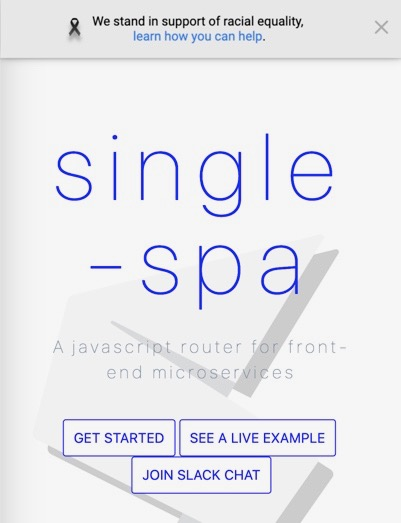

# allies
A script that allows your organization to express your support for equality

## Usage
Simply add the following script to your page:

```html
<script src="https://cdn.jsdelivr.net/npm/allies@1.0.1/allies.js"></script> 
```

## Example

