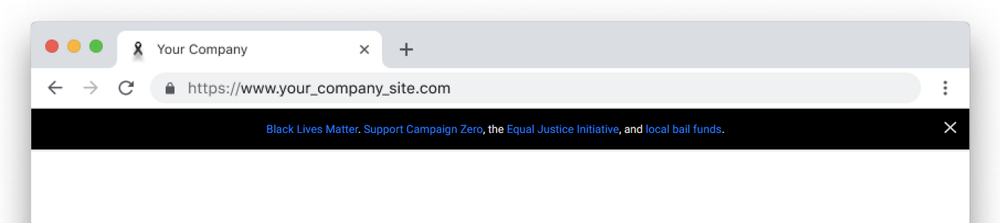

# racial-equity-banner
Show your support for Racial Equity and Justice by adding this banner to your company or personal website. The banner will appear at the top of the website and link to https://blacklivesmatters.carrd.co/ for resources, places to donate etc.

<p align="center">
  
</p>

## Usage
Simply add the following script to your page:

```html
<script src="https://cdn.jsdelivr.net/npm/racial-equity-banner@1.0.1/racial-equity-banner.js" async></script> 
```

If you want the banner fixed the bottom of the page, use:

```html
<script src="https://cdn.jsdelivr.net/npm/racial-equity-banner@1.0.1/racial-equity-banner-bottom.js" async></script> 
```

If you want a fullscreen modal:

```html
<script src="https://cdn.jsdelivr.net/npm/racial-equity-banner@1.0.1/racial-equity-banner-fullscreen.js" async></script> 
```

## Example

